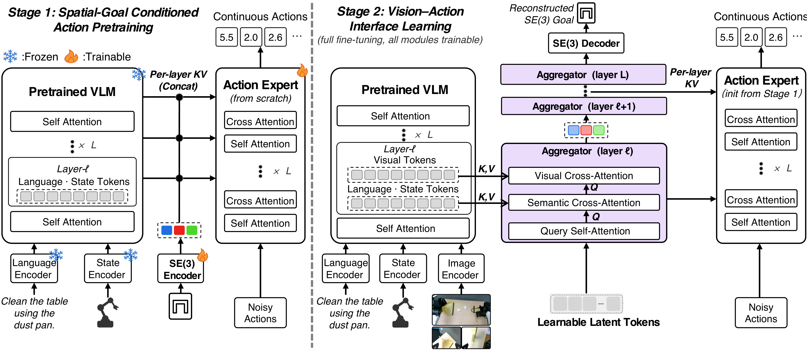

<div align="center">

# Latent Interface Training

### Breaking the Vision–Action Shortcut for Generalizable Robot Foundation Models

[Jianman Lin](https://github.com/jianmanlincjx)<sup>1\*</sup> · Shailesh Shailesh<sup>2\*</sup> · Zhongyi Luo<sup>3</sup> · Jiafei Duan<sup>2†</sup>

<sup>1</sup>South China University of Technology · <sup>2</sup>National University of Singapore · <sup>3</sup>Nanyang Technological University

[](https://jianmanlincjx.github.io/LIT/)
[](https://jianmanlincjx.github.io/LIT/static/paper/LIT.pdf)
[](https://huggingface.co/linjianman/LIT)
[](./LICENSE)



</div>

LIT keeps a robot foundation model's backbone and action expert as they are and changes only the interface
between them. Direct conditioning on visual tokens is removed; a small set of learnable latent tokens —
supervised to reconstruct the terminal SE(3) end-effector pose — becomes the action expert's **only** route
to vision. **Stage 1** learns an action prior from language, state and that pose with no images.
**Stage 2** trains the interface. The same recipe, with the same interface settings, is applied to four
architectures.

<div align="center">

| | π0.5 | MolmoAct2 | FAST-WAM | ImageWAM | Real robot (3 tasks) |
| --- | :-: | :-: | :-: | :-: | :-: |
| **LIBERO-Plus / OOD success, Base → LIT** | 68.97 → **79.67** | 63.62 → **71.92** | 51.44 → **60.63** | 83.02 → **86.89** | 53.3 → **70.0** (lighting) · 30.0 → **46.7** (camera) · 50.0 → **63.3** (distractors) |

<sub>Zero-shot on all 10,030 LIBERO-Plus tasks; Overall is the mean over the seven perturbation axes. In-distribution LIBERO success is preserved or improved on every architecture.</sub>

</div>

**Contents** &nbsp; [Code](#code) · [Checkpoints](#checkpoints) · [Quick start](#quick-start) · [Two things that change the numbers](#two-things-that-change-the-numbers) · [Layout](#layout) · [Citation](#citation)

---

## Code

One fork per framework. Every README has the same three parts — **① evaluate the released checkpoint**,
**② train, then evaluate** (from the pretrained base), **③ how LIT is integrated in that framework** —
and keeps the upstream README as `README_upstream.md`. Use the pinned branch and commit.

| Framework | Repository | Branch | Commit | Verified on a fresh machine |
| --- | --- | --- | --- | --- |
| MolmoAct2 | [Molmoact2](https://github.com/jianmanlincjx/Molmoact2) + [lerobot](https://github.com/jianmanlincjx/lerobot) submodule | `feat/libero-goal-prior-v4` | `0dc1d64` / `b966b8c0` | ✅ weights load; LIBERO and LIBERO-Plus rollouts |
| π0.5 | [Pi05](https://github.com/jianmanlincjx/Pi05) | `main` | `4209419` | ✅ baseline and LIT weights load; rollouts |
| FAST-WAM | [fastwam](https://github.com/jianmanlincjx/fastwam) | `feat/goal-pose-prior` | `77d3632` | ✅ LIT weights load; rollouts (environment recipe in its README) |
| ImageWAM | [ImageWAM](https://github.com/jianmanlincjx/ImageWAM) | `feat/goal-prior-bottleneck-fix` | `6b5d02d` | ⏳ environment build |

## Checkpoints

The stage-2 models reported in the tables are on Hugging Face: **[linjianman/LIT](https://huggingface.co/linjianman/LIT)**
(41 GB total; ModelScope mirror to follow).

```bash
hf download linjianman/LIT --local-dir LIT_ckpt                          # all four
hf download linjianman/LIT --include "molmoact2/*" --local-dir LIT_ckpt  # one framework
```

| Directory | Format | How to point the evaluator at it |
| --- | --- | --- |
| `molmoact2/lit_stage2`, `pi05/lit_stage2` | LeRobot policy directory (`config.json` + `model.safetensors` + normalisers) | `--policy.path <dir>` |
| `fastwam/lit_stage2`, `imagewam/lit_stage2` | `model.pt` + `config.yaml` + `dataset_stats.json` | `ckpt=<dir>/model.pt` `dataset_stats_path=<dir>/dataset_stats.json` |

Stage-1 action priors and the MolmoAct2 / π0.5 baselines we fine-tuned are available on request;
the FAST-WAM and ImageWAM baselines are the authors' released weights.

## Quick start

MolmoAct2, from a clean machine. The other three forks follow the same three steps in their own READMEs.

```bash
git clone --recursive -b feat/libero-goal-prior-v4 https://github.com/jianmanlincjx/Molmoact2.git
git clone https://github.com/jianmanlincjx/LIT.git && cd LIT

export LIT_MOLMOACT2=/path/to/Molmoact2
export LIBERO_PLUS_ROOT=/path/to/LIBERO-plus            # github.com/sylvestf/LIBERO-plus
bash scripts/preflight.sh LIT_ckpt/molmoact2/lit_stage2  # submodule commit, LIBERO-Plus, GPUs, checkpoint
```

<details open>
<summary><b>① Evaluate the released checkpoint</b></summary>

```bash
bash scripts/eval_libero_plus.sh lit LIT_ckpt/molmoact2/lit_stage2   # LIBERO-Plus: 10,030 tasks, seed 1000
bash scripts/eval_libero.sh      lit LIT_ckpt/molmoact2/lit_stage2   # LIBERO: 4 suites × 50 episodes
```

Both are resumable across GPUs and print the per-axis / per-suite result when they finish.
`scripts/aggregate.py <results-root>` re-aggregates later; `--pair <a> <b>` compares two runs on the tasks both finished.

</details>

<details>
<summary><b>② Train, then evaluate</b></summary>

```bash
export DATASET_ROOT=/path/to/libero_lerobot_format
cd "$LIT_MOLMOACT2"
bash scripts/libero_goal_prior/train_baseline.sh   # baseline, 30K steps
bash scripts/libero_goal_prior/train_stage1.sh     # Stage 1: no images, 10K steps
bash scripts/libero_goal_prior/train_stage2.sh     # Stage 2: latent interface, 30K steps, from Stage 1
```

Then evaluate `outputs/…/checkpoints/030000/pretrained_model` as in ①. Stage 2 reports the Stage-1
SE(3) encoder as unexpected keys when it loads — expected; the encoder is training-time only.

</details>

## Two things that change the numbers

- **`LIBERO_PLUS_FIX_LANG=1`** — set by the scripts. Without it the LIBERO-Plus harness feeds the
  perturbation parameters to the policy as its instruction, and every axis drops by several points.
- **Overall = arithmetic mean over the seven perturbation axes** (Camera 1,599 · Noise 1,601 · Lighting 1,142 ·
  Background 1,076 · Robot 1,550 · Layout 1,525 · Language 1,537 tasks). The task-weighted rate is about two
  points lower; `aggregate.py` prints both and labels the reported one.

## Layout

```
README.md              this page
docs/                  project page (GitHub Pages, served from /docs)
scripts/
  env.sh preflight.sh                  paths and pre-run checks
  eval_libero.sh eval_libero_plus.sh   the two evaluation protocols (MolmoAct2; resumable, sharded)
  aggregate.py                         per-axis / per-suite aggregation, paired comparison of two runs
  render_pose_videos.sh                rollouts with the decoded pose drawn back onto the frame
results/
  ablation_results.{tsv,csv,md}        Table III as evaluated (all arms, seven axes, ID)
  extract_tables_from_pdf.py           pulls Tables I–III out of the submission PDF and checks them digit for digit
  editors/*.html                       offline table editors that export the paper's LaTeX
archive/paper_runs/                    launchers exactly as run for the paper (machine-specific; provenance only)
```

Per-framework training and evaluation scripts live in the forks at their pinned commits, not here.

## Citation

```bibtex
@article{lin2026lit,
  title   = {Breaking the Vision--Action Shortcut: Latent Interface Training
             for Generalizable Robot Foundation Models},
  author  = {Lin, Jianman and Shailesh, Shailesh and Luo, Zhongyi and Duan, Jiafei},
  journal = {Under review},
  year    = {2026}
}
```
