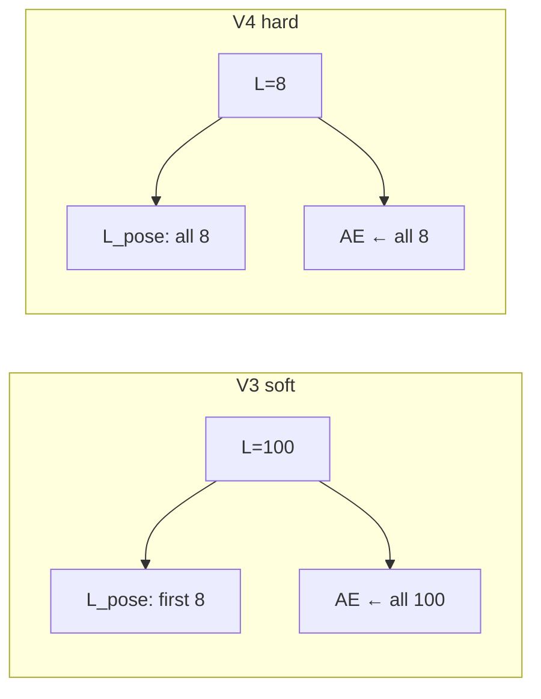
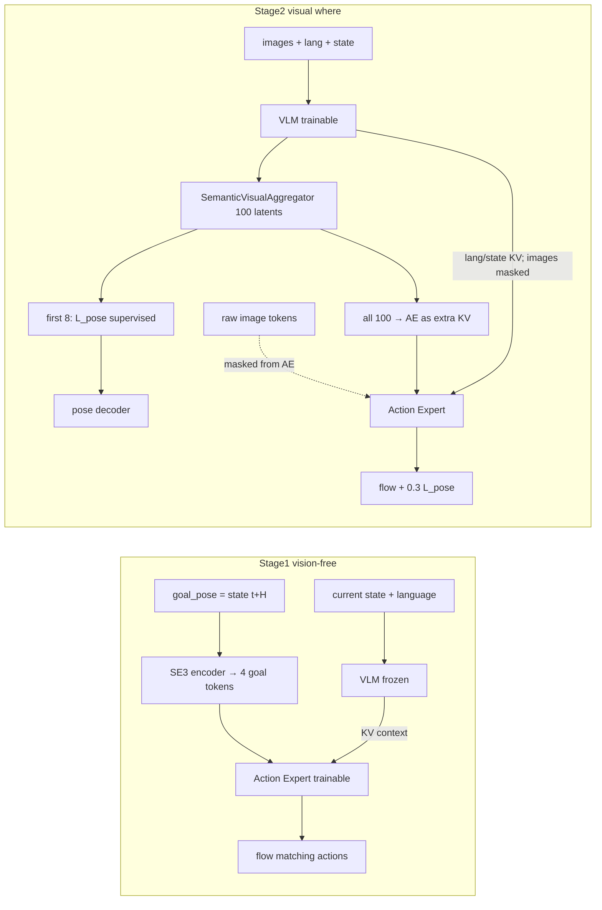
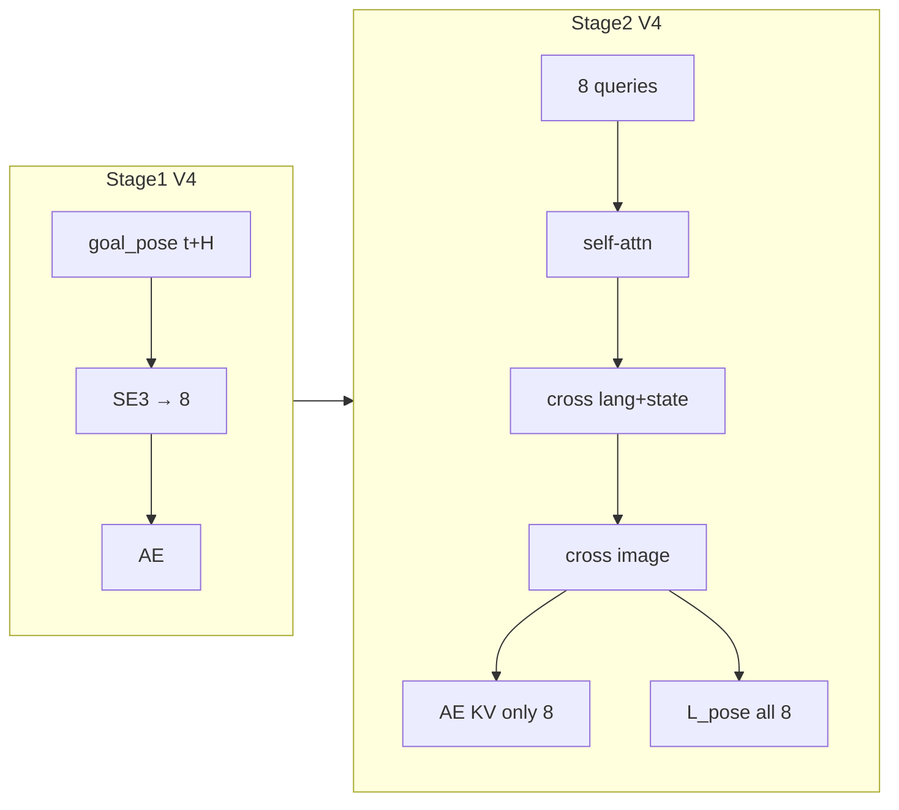
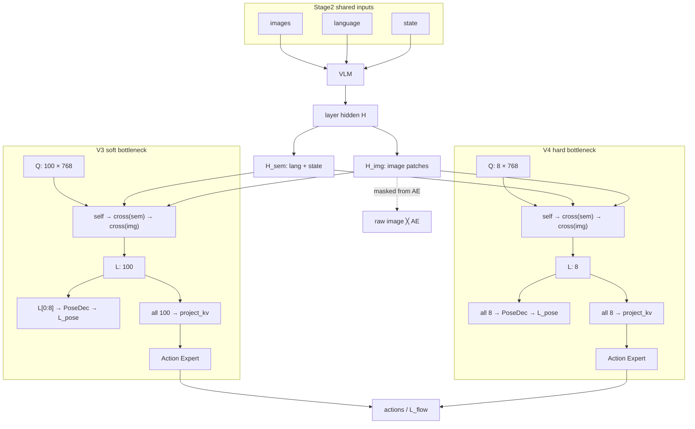
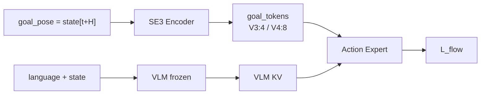

# Goal-Pose Prior — V3 / V4 完整架构与特征流

> **同步用单一文档**：V3 基线、V4 差分、特征流、画图节点/边清单都在本文件。  
> 路径：`scripts/libero_goal_prior_v4/V3_VS_V4_FEATURE_FLOW.md`

| 相关脚本 | 作用 |
| --- | --- |
| [`../libero_goal_prior_v3/`](../libero_goal_prior_v3/) | V3 训练 / stats |
| [`./`](./) | V4 训练 |
| `lerobot/.../modeling_molmoact2.py` | Aggregator、L_pose、image mask |

**Checkpoint（config 已核对）：**

- V3：`lerobot/outputs/libero_goal_prior_v3/seed_1000/stage2/checkpoints/025000/pretrained_model`
- V4：`lerobot/outputs/libero_goal_prior_v4/seed_1000/stage2/checkpoints/025000/pretrained_model`

---

## 0. 一句话对照

| | **V3（软瓶颈）** | **V4（硬瓶颈）** |
| --- | --- | --- |
| 定位 | v2b 架构 + 修正 QUANTILES | 在 V3 上把 latent 收成 pose-only |
| Stage1 `goal_tokens` | **4** | **8** |
| Stage2 latents | **100** = 8 pose + 92 context | **8** = 全部 pose |
| 进 Action Expert 的 latent | **全部 100** | **全部 8** |
| `L_pose` 监督 | 仅前 **8** | **全部 8** |
| Aggregator / 6 groups / image→AE mask | 相同 | 相同 |
| QUANTILES | 重算（相对 v2b） | **复用 V3** |
| Stage2 LR | VLM `1e-5`；AE+Agg `1e-4`（wu 5k） | **同 V3-25k / StarVLA 对齐** |

**V3**：监督窄、条件通道仍宽（92 无监督 context 可把视觉送进 AE）。  
**V4**：监督宽度 = 条件宽度 = 8（无 unsupervised context 旁路）。



---

# Part I — V3 网络架构基线

V3 **不改模型代码结构**：= **v2b（scheme-2a semantic-visual recurrent）** + 修正后的 `observation.state` / `action` QUANTILES。

## I.1 Stage2 关键配置（025000）

| 项 | 值 |
| --- | --- |
| `num_semantic_visual_tokens` | 100 |
| `num_semantic_visual_pose_tokens` | 8（仅前 8 进 L_pose） |
| `semantic_visual_num_layer_groups` | 6 |
| `semantic_visual_enable_self_attention` | true |
| `mask_image_from_action_expert` | true |
| `pose_recon_loss_weight` | 0.3 |
| `target_pose_delta_index` / `chunk_size` | 10 |
| VLM / ViT / connector LR | `1e-5`（warmup 1k / ViT 2k） |
| AE / semantic-visual LR | `1e-4`（warmup 5k） |

## I.2 总体角色分工



- **Stage1**：学 **how**（无图、GT goal EE 条件）。
- **Stage2**：学 **where**（视觉聚合 goal），并继续训 how；AE **看不到原始 image token**，视觉只能经 latent 进入。

## I.3 Stage1（V3）

入口：`scripts/libero_goal_prior_v3/train_stage1.sh`

| 项 | 值 |
| --- | --- |
| 视觉 | `disable_visual_input=true` |
| 可训 | `train_action_expert_only=true`（AE + goal SE3；VLM 冻） |
| Goal | `goal_token_source=se3_encoder`，`num_goal_tokens=4` |
| 目标位姿 | `target_pose_delta_index=10` = chunk 终点 `state[t+H]`（归一化） |
| Loss | 仅 flow matching（无 L_pose） |
| Bootstrap | Molmo2-ER VLM + 随机 AE |
| 步数 | 10k，bs 128/卡（默认） |

Goal 经 SE(3) encoder 成 4 个 token，进入 AE 条件路径。推理探针必须真正注入 `batch['goal_pose']`。

## I.4 Stage2（V3 = v2b scheme-2a）

入口：`scripts/libero_goal_prior_v3/train_stage2.sh`

| 项 | 值 |
| --- | --- |
| 模式 | `goal_conditioning_mode=semantic_visual_recurrent` |
| Latent 总数 | **100** |
| Pose 组 | **前 8** — 仅这 8 个进 L_pose |
| Context 组 | **后 92** — **无 pose 监督，但仍进 AE** |
| 隐维 / 头 | 768 / 8 heads，FFN×4 |
| 层组 | **6** groups |
| Self-attn | **开**（pose↔context 可混信息） |
| 图像→AE | `mask_image_from_action_expert=true` |
| Loss | `L_flow + 0.3 * L_pose` |
| 初始化 | 强制 V3 Stage1 `010000` |
| 步数 | 30k，bs 32/卡（默认） |

### 每层信息流（训练 / 推理同构）

1. VLM decoder layer → hidden（lang / state / image patches）。
2. Aggregator：`self-attn(100)` → `cross-attn(semantic=lang/state)` → `cross-attn(visual=image)`。
3. 100 latent 经 `project_kv` → 拼到该层给 AE 的 **context KV**。
4. AE cross-attend：**无** raw image；有 **全部 100 latent** + 非 image 的 VLM token。
5. `L_pose` 只读 `latent[:, :8]` → LayerNorm → PoseDecoder → 重建归一化 `goal_pose`。

> only the first `num_semantic_visual_pose_tokens` are supervised by L_pose …  
> **all tokens still condition the action expert**.

→ **软瓶颈**：8 有 pose 监督，92 context + self-attn 仍可旁路视觉进 AE。

## I.5 与「解耦假设」的对照

| 设计意图 | V3 实现 | 备注 |
| --- | --- | --- |
| 视觉不直灌 AE | raw image 对 AE mask | 成立 |
| where 经 pose bottleneck | 仅 8 有 L_pose | **部分**：92 context 仍可旁路 |
| how 复用 Stage1 | Stage2 从 Stage1 AE 初始化并继续训 | AE 可被 Stage2 视觉捷径改写 |
| goal = 未来 EE | `state[t+10]` 监督 | 非显式物体坐标 |

## I.6 数据 / 归一化（V3 相对 v2b）

- 重算 state/action q01/q99（Z 不再 clip 到 ~0.88）；见 `fix_stats.sh`。
- Goal pose 与 L_pose 目标均在 **QUANTILES 归一化空间**。
- 评测 overlay 须用 ckpt 的 q01/q99 反归一化。

---

# Part II — V4 硬瓶颈配方

相对 V3 **只改 bottleneck 宽度**；共享 `MolmoAct2` 代码默认仍为 `100/8`，仅 `scripts/libero_goal_prior_v4/` 显式传 `8/8`。

## II.1 差分一览

| 项 | V3 | V4 |
| --- | --- | --- |
| Stage1 `num_goal_tokens` | 4 | **8**（SE3） |
| Stage2 latents | 100 = 8 + 92 context | **仅 8 pose** |
| 进 AE | 全部 100 | **仅 8** |
| L_pose | 前 8 | **全部 8** |
| Aggregator 顺序 / 6 groups | 同 | 同 |
| image→AE mask | on | on |
| QUANTILES | v3 重算 | **复用 v3** |
| Stage2 LR / warmup | VLM `1e-5`；AE+SV `1e-4` | **同左** |



## II.2 Stage1 / Stage2 入口

- Stage1：`train_stage1.sh` → `NUM_GOAL_TOKENS=8`，输出 `libero_goal_prior_v4/.../stage1`
- Stage2：`train_stage2.sh` → `tokens=8`、`pose=8`，强制从 **V4** Stage1 `010000` 初始化
- 评测：`scripts/libero_eval/eval_libero_v4_checkpoint.sh`（须校验 8/8）

## II.3 兼容性

- `MolmoAct2Config` 允许 `pose_tokens <= total`（含相等）；默认仍 `100/8`、`num_goal_tokens=4`。
- `pose < total` 时行为与 V3 软瓶颈相同。
- 不修改 `libero_goal_prior_v2b/` / `libero_goal_prior_v3/` 脚本。

## II.4 动机（简述）

V3 in-dist 强，但假设 92 无 L_pose 的 context + self-attn 仍可把布局–轨迹捷径送进 AE。  
V4 去掉该旁路，强迫视觉挤过 **8 维 pose bottleneck**（代价：表达容量下降，难例如 Spatial-5 可能掉点）。

---

# Part III — 特征流（供画两张框架图）

## III.1 建议画法

两图**同一布局**，只改三处：

1. Stage1：`goal_tokens` 4 vs 8  
2. Stage2：`Q/L` 长度 100 vs 8  
3. Stage2：`L → AE` / `L → L_pose` 分流着色  

```text
┌──────────── 上：Stage1（how，无图）────────────┐
│  language+state → VLM(冻) → KV                  │
│  goal_pose(t+H) → SE3 → goal_tokens → AE → L_flow│
└─────────────────────┬───────────────────────────┘
                      │ init AE
┌─────────────────────▼───────────────────────────┐
│ 下：Stage2（where + how，有图）                   │
│  img+lang+state → VLM → Aggregator → AE / L_pose │
└─────────────────────────────────────────────────┘
```

## III.2 Stage1 特征流（共用，只差宽度）

```text
输入（训练）
  language ──┐
  state(t) ──┼──► VLM（冻结）──► VLM KV（无 image）
             │
  goal_pose = state[t+H]（QUANTILES 归一化；仅训练注入）
             │
             ▼
        SE3 Encoder
             │
             ▼
     goal_tokens          ←── V3: 4 | V4: 8
             │
             ▼
     Action Expert ◄── 条件：VLM KV + goal_tokens
             │
             ▼
        flow matching ──► L_flow
```

- **没有** image / Aggregator / `L_pose`
- Stage2 从**同版本** Stage1 `010000` 初始化

## III.3 Stage2 共用主干

对 VLM 深度上的 **每一层组**（共 **6 groups**；共享同一组 learnable queries，各组有各自的 `project_kv`）：

```text
输入（每步）
  images ──┐
  language ┼──► VLM（可训）──► 该层 hidden H
  state    ┘         │
                     ├─ H_sem = lang + state tokens
                     └─ H_img = image patch tokens

learnable queries Q
  V3: 100 × 768
  V4:   8 × 768
        │
        ▼
┌────────────── Aggregator group（顺序固定）──────────────┐
│  ① self-attn(Q)                                         │
│  ② cross-attn(Q ← H_sem)                                │
│  ③ cross-attn(Q ← H_img)                                │
│  输出 latents L（长度 = |Q|）                             │
└────────────────────────────────────────────────────────┘
        │
        ├──────────────────────────┬─────────────────────
        ▼                          ▼
   project_kv(L)              pose 分支（§III.4 / §III.5）
   → (K_lat, V_lat)
        │
        ▼
   AE context KV = concat(
         VLM_KV_without_image,   ← raw image 对 AE 屏蔽
         K_lat, V_lat            ← 视觉进 AE 的唯一通道
       )
        │
        ▼
   Action Expert ──► actions ──► L_flow

总损失：L = L_flow + 0.3 · L_pose
```

**必须画出的屏蔽边：**

```text
image tokens ──╳──► Action Expert
              mask_image_from_action_expert = true
```

图面拥挤时：画一个 group + 旁注 `×6 along VLM depth`。

## III.4 V3 软瓶颈分流

```text
L (100)
 ├─ L[:, 0:8]   → LayerNorm → PoseDecoder → L_pose
 └─ L[:, 8:100] （无 L_pose）
        │
        └── 全部 L(100) → project_kv → AE KV
```

图注：监督=8（红）；条件=100（红+灰）；self-attn 允许旁路。

## III.5 V4 硬瓶颈分流

```text
L (8)
 └─ 全部 L[:, 0:8]
        ├─→ LayerNorm → PoseDecoder → L_pose
        └─→ project_kv → AE KV
```

图注：监督宽度 = 条件宽度 = 8；无 context 旁路。

## III.6 并排 Mermaid 草稿



Stage1 小图：



---

# Part IV — 画图节点 / 边清单

## IV.1 节点

| ID | 名称 | 阶段 | 备注 |
| --- | --- | --- | --- |
| `lang` | language tokens | S1/S2 | |
| `state` | 当前 state | S1/S2 | |
| `img` | image patches | **仅 S2** | |
| `goal_gt` | `goal_pose=state[t+H]` | **仅 S1 训练** | 归一化；非物体坐标 |
| `vlm` | VLM | S1 冻 / S2 训 | |
| `h_sem` | lang+state hidden | S2 | |
| `h_img` | image hidden | S2 | **不直连 AE** |
| `se3` | SE3 encoder | S1 | |
| `goal_tok` | SE3 goal tokens | S1 | V3:4 / V4:8 |
| `Q` | learnable queries | S2 | V3:100 / V4:8，dim 768 |
| `agg` | Aggregator group | S2 | self→sem→img；×6 |
| `L` | latents | S2 | 与 Q 同长 |
| `pose_dec` | LN + PoseDecoder | S2 | |
| `proj_kv` | `project_kv` | S2 | |
| `ae` | Action Expert | S1/S2 | |
| `act` | action chunk | S1/S2 | |
| `L_flow` / `L_pose` | 损失 | S2 两者；S1 仅 flow | pose 权重 0.3 |

## IV.2 边

**Stage1：** `lang/state→VLM→AE`；`goal_gt→SE3→goal_tok→AE`；`AE→L_flow`。

**Stage2 共用：** `img/lang/state→VLM→H_sem/H_img`；`Q+H_*→Agg→L`；`VLM_KV(无图)→AE`；`img──╳──AE`；`AE→L_flow`。

**V3 着色：** `L[0:8]→PoseDec`；`L[0:100]→project_kv→AE`。

**V4 着色：** `L[0:8]→PoseDec` 且 `L[0:8]→project_kv→AE`。

## IV.3 画图禁忌

1. 不是「V4 去掉 Aggregator」——只是 `N: 100→8`。  
2. 不是「V3 的 92 context 不进 AE」——它们**进 AE**，只无 `L_pose`。  
3. `L_pose` 目标是 **未来 EE**，不是 object pose。  
4. 推理**不用** future GT pose。  
5. 代码默认 `100/8`；V4 由 v4 脚本显式传 `8/8`。

---

# Part V — Config 速查与改架构清单

## V.1 Config（025000）

| 字段 | V3 | V4 |
| --- | --- | --- |
| `goal_conditioning_mode` | `semantic_visual_recurrent` | 同 |
| `num_semantic_visual_tokens` | 100 | **8** |
| `num_semantic_visual_pose_tokens` | 8 | **8** |
| `num_goal_tokens` | 4 | **8** |
| `semantic_visual_num_layer_groups` | 6 | 6 |
| `semantic_visual_enable_self_attention` | true | true |
| `semantic_visual_hidden_dim` | 768 | 768 |
| `mask_image_from_action_expert` | true | true |
| `pose_recon_loss_weight` | 0.3 | 0.3 |
| `target_pose_delta_index` / `chunk_size` | 10 | 10 |

## V.2 改架构前检查

1. 动的是 Stage1 还是 Stage2？  
2. latent 里哪些进 AE、哪些有 L_pose？  
3. `mask_image_from_action_expert` 是否仍符合意图？  
4. `goal_pose` 是否仍是 `state[t+H]`（归一化）？  
5. 新实验是否用新 `OUTPUT_DIR`，避免覆盖 v3/v4-25k 基线？
